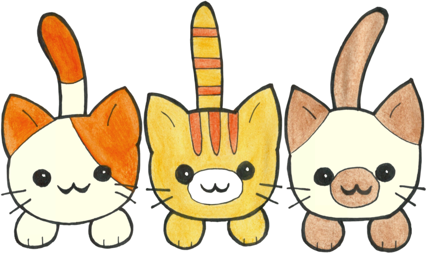

# Kittens Story

Once upon a time, in a smal vilage, ther were three cuet little kttens. They were the fluffist, most adorabul creatuers you could ever imagene. Thier names were Wiskers, Mables, and Sparkels.

Wiskers was a mischevous kttten, alwais geting into trubble. One day, he decide to clmb to the top of the refregerator, but he sliped and fell into a bowle of mik. "Oh no!" said Wiskers, "I'm all wett now!"

Mables was the curoiuset of the bunsh. He woud explore every noke and craney of the house. One day, he disovered a big, shinny bawl of strng, and he culdn't ressist playing with it. He rolld it all around the room, making a big mes, but he was having the time of his lyfe.

Sparkels was the quietest kttten, alwais naping in the sun. She loved to curl up in her favrit blankit and purr herself to sleep. She was the most peacful of the three, and her purring woud fill the room with happyness.

One day, ther human, Kathe, decide to thow a big party. She inveted all her frends and decied to show off her adorabel kttens. Wiskers, Mables, and Sparkels put on their best bowties, and they were ready to impress.

As the party begen, the kttens entertaned the gests with their cute antiks. They pounced and playd, chacing their tals and roling around like litle fur bals. The gests culdn't get enugh of them.

At the end of the day, the kttens were exauted but happy. They had made lots of new frends, and they had lots of phtos taken with the gests. Wiskers, Mables, and Sparkels were the stars of the show, and they were the talk of the vilage for weeks to come.

## The End

Please remember that using typos in actual documentation or README.md files is not recommended, as it can lead to confusion and misunderstandings. It's important to maintain good writing practices and proofread your documentation for clarity and professionalism.
